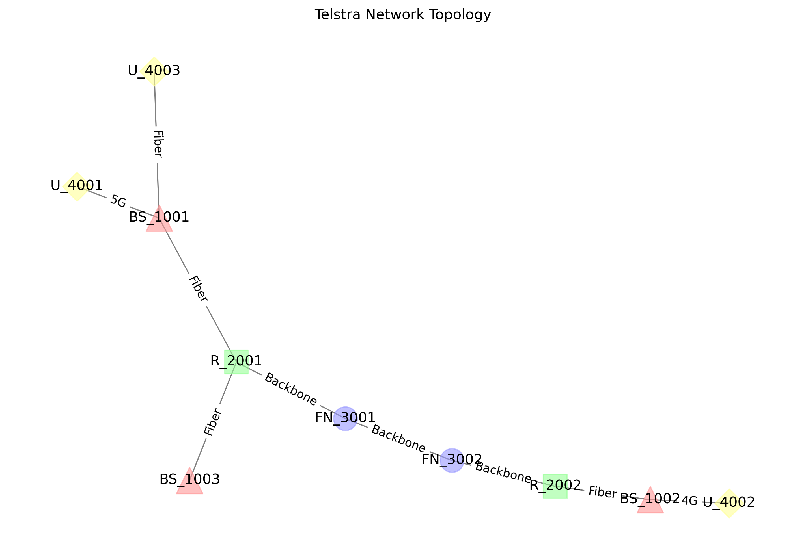

# Telstra Network Neo4j Demo

This project demonstrates network topology management using Neo4j graph database with Python. It includes base stations, routers, fiber nodes, and user devices management for Telstra's network infrastructure, with multiple visualization options.

## Table of Contents
- [Prerequisites](#prerequisites)
- [Setup](#setup)
- [Features](#features)
- [Visualization Results](#visualization-results)
- [Project Structure](#project-structure)

## Prerequisites
- Python 3.9 or higher
- Conda package manager
- Neo4j Database (local or remote instance)

## Setup

### 1. Clone the Repository
```bash
git clone <repository-url>
cd telstra-neo4j-demo
```

### 2. Install Dependencies
```bash
pip install neo4j networkx matplotlib pyvis plotly numpy
```

### 3. Configure Neo4j
Create a `Neo4j-Authentication.txt` file with the following format:
```plaintext
NEO4J_URI=neo4j://localhost:7687
NEO4J_USERNAME=your_username
NEO4J_PASSWORD=your_password
```

## Features

### Network Components

#### Base Stations (5G/4G)
- Location-based deployment
- Capacity and status tracking

#### Routers
- Different models and bandwidth capabilities

#### Fiber Nodes
- Latency monitoring
- Provider information

#### User Devices
- Multiple connection types (5G, 4G, Home Broadband)
- User ownership tracking

### Network Relationships
- Base Station to Router connections
- Router to Fiber Node connections
- Fiber Node interconnections
- User Device to Base Station connections
- Connection properties (type, speed)

### Visualization Types
1. Static Visualization (matplotlib)
   - Basic network topology view
   - Saved as 'network_topology.png'

2. Interactive Visualization (pyvis)
   - Interactive node manipulation
   - Custom icons for different node types
   - Relationship details on hover
   - Saved as 'network_topology.html'

3. Plotly Visualization
   - Alternative interactive view
   - Color-coded node types
   - Saved as 'network_topology_plotly.html'

4. 3D Visualization
   - Three-dimensional network view
   - Spherical distribution of nodes
   - Saved as 'network_topology_3d.html'

## Visualization Results

### Static Network Topology


This static visualization shows the network topology with different node types represented by distinct shapes and colors:
- BaseStation (^): Light red triangles representing signal towers
- Router (□): Light green squares representing network routers
- FiberNode (○): Light blue circles representing fiber connection points
- UserDevice (◇): Light yellow diamonds representing end-user devices

The edges show connection types and speeds between different network components.

### Interactive Visualizations
For interactive exploration of the network topology, the following files are generated:
- `network_topology.html`: Interactive visualization with hoverable nodes and edges
- `network_topology_plotly.html`: Plotly-based interactive visualization
- `network_topology_3d.html`: 3D interactive visualization of the network

To view the interactive visualizations, open the respective HTML files in a web browser.

## Project Structure

telstra_neo4j_demo.py
├── setup_neo4j_env.sh
├── telstra_neo4j_demo.py
└── README.md
